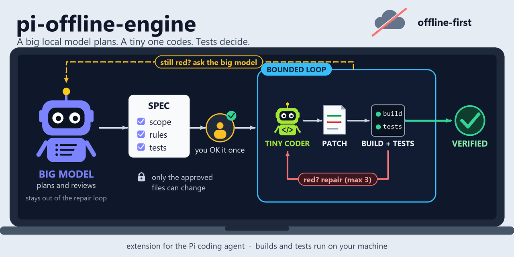
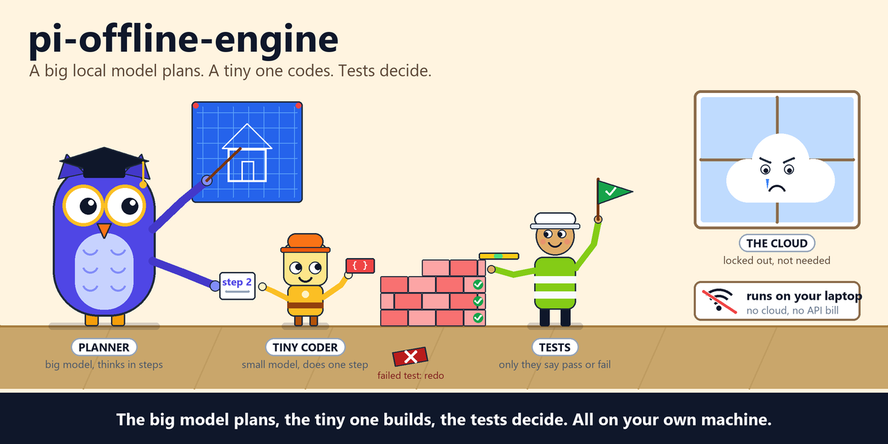

<p align="center">
  
</p>

<h1 align="center">pi-offline-engine</h1>

<p align="center"><b>Большая локальная модель планирует, крошечная локальная пишет код, а решают настоящие сборка и тесты .NET — всё на вашей машине. Офлайн-расширение для агента Pi.</b></p>

<p align="center">
  <a href="https://nodejs.org/"></a>
  <a href="#установка"></a>
  <a href="#текущий-вертикальный-срез"></a>
  <a href="package.json"></a>
</p>

<p align="center"><a href="README.md">English</a> | <b>Русский</b></p>

```bash
pi install git:github.com/AndrewMoryakov/pi-offline-engine
llama-server -m qwen2.5-coder-3b-instruct-q4_k_m.gguf   # the tiny implementer, listens on :8080
pi                                                      # then run /offline-doctor
```

Офлайн-first эксперименты с расширениями для coding-агента Pi.

Проект исследует составную локальную систему кодирования: большая локальная модель остаётся для рассуждений и архитектуры, а детерминированные инструменты и гораздо меньшая локальная модель для кода выполняют ограниченную работу по реализации.

## Зачем pi-offline-engine?

- **Если** ваша основная локальная модель большая и медленная, **то** тратить её ходы на рутинные правки и циклы «собрать — починить» не хочется: она пишет строгую спецификацию, крошечный локальный кодер делает ограниченную реализацию, а большая модель остаётся вне дешёвого цикла починки.
- **Если** вы работаете офлайн или вот-вот отключитесь от сети, **то** всё выполняется на вашей машине: движок находит локальный OpenAI-совместимый сервер на loopback, а `/offline-doctor` говорит, готовы ли вы, пока сеть ещё есть.
- **Если** вы не доверяете маленькой модели свой репозиторий, **то** зона поражения узкая: вы один раз одобряете объявленный набор файлов, записи точные и проверяются по области, устаревший файл отклоняется, а решают настоящие результаты `dotnet build` / `dotnet test`, а не мнение модели.
- **Если** вам нужна работающая локальная конфигурация без ручной сборки, **то** одна команда `pi install` приносит движок и четыре закреплённых сопутствующих расширения (поиск, LSP, code tool, lean edit).

Это **не** универсальный кодер для любого стека: сегодня проверка только для .NET (`dotnet build` / `dotnet test`), а другие инструментальные цепочки в репозитории не описаны. Это не замена ревью — результат `verification_passed` означает лишь, что объявленные проверки компилятора и тестов прошли, а не что задача решена по смыслу, поэтому основной агент должен просмотреть diff. Это Git-распространяемый пакет Pi (`private: true`), он не опубликован в npm и пока экспериментальный. Указать крошечному исполнителю хостовый роутер можно, но это [не офлайн-конфигурация](#хостовые-openai-совместимые-роутеры-openrouter). Одобренный набор файлов ограничивает то, что может записать кандидат; это не песочница файловой системы, потому что `dotnet build` и `dotnet test` затем запускаются в вашем репозитории с вашими правами и могут создавать файлы (например, в `bin`/`obj`) или выполнять хуки сборки и тестов проекта.

## Возможности

- **Два инструмента Pi** — `delegate_implementation` (только кандидат, без записи) и `execute_delegated_implementation` (ограниченный цикл с защищёнными записями и детерминированной проверкой).
- **Строгий `ImplementationSpec` v1** — операция, цель, требования, разрешённый набор файлов и проверка объявляются заранее; делегирование ограничено не более чем двумя файлами.
- **Одно одобрение, точные записи** — пользователь один раз одобряет объявленный набор файлов; кандидат применяется только как точный `replace_text` или явно разрешённый `create_file`, после проверки SHA-256 исходного состояния и устаревания.
- **Детерминированная проверка .NET** — `dotnet build` / тесты с `--no-restore`; VSTest использует целевые запуски TRX, а .NET 10 Microsoft.Testing.Platform — `--report-trx`.
- **Дешёвый цикл починки** — при сбое компактный `RepairPacket` возвращается к TinyCoder (до двух починок); если всё ещё красно, работа эскалируется основной модели.
- **Готовый сопутствующий стек** — `pi-knowledge`, `pi-lsp-extension`, `pi-code-tool` и `pi-lean-edit` идут закреплёнными версиями и загружаются через манифест этого пакета.
- **Офлайн-эксплуатация** — `/offline-doctor`, `/offline-setup`, `/offline-tools minimal`, сжатие большого вывода `dotnet` и детерминированная капсула контекста репозитория.
- **Ничего не утекает тихо** — ключ API никогда не сохраняется в файл конфигурации, `events.jsonl`, записи кандидатов или обучающие данные, а сбор обучающих данных выключен, пока вы его не включите.

## Как это работает

<p align="center">
  
</p>

1. **Большая модель планирует.** Она пишет строгий `ImplementationSpec` — область, требования и сборку/тесты для запуска — а вы один раз одобряете объявленные файлы.
2. **Крошечный кодер предлагает патч.** Движок снимает SHA-256 каждого разрешённого файла, затем просит локальный TinyCoder о кандидате; если информации не хватает, он должен вернуть `insufficient_spec`, а не гадать.
3. **Движок применяет и проверяет.** Кандидат валидируется, проверяется на устаревание и применяется точно, затем запускаются `dotnet build` и тесты с `--no-restore`.
4. **Красное — это починка, а не поход к большой модели.** Компактный `RepairPacket` уходит к TinyCoder, до двух починок; зелёный результат даёт свидетельство `verification_passed`, а всё ещё красный — эскалацию основной модели.

## Быстрый старт

Нужны Pi 0.86.1 (проверенная базовая версия хоста), Node.js 22.19.0 или новее и локальный OpenAI-совместимый сервер для крошечного кодера. Подробности, закрепление версий и случаи конфликта `edit` — в разделе [Установка](#установка).

```bash
pi install git:github.com/AndrewMoryakov/pi-offline-engine
llama-server -m qwen2.5-coder-3b-instruct-q4_k_m.gguf   # llama.cpp / ik_llama.cpp, listens on :8080
pi
```

При первом запуске сессии движок находит локальный сервер и сохраняет его. Затем подтвердите готовность внутри Pi:

```text
/offline-doctor
```

Из клона, для разработки: `pi -e ./extensions/index.ts`. Чтобы испытать конвейер на одноразовой фикстуре .NET, а не на своём репозитории, см. [Первый реальный приёмочный прогон](#первый-реальный-приёмочный-прогон).

## Текущий вертикальный срез

Предоставляются два инструмента Pi:

- `delegate_implementation` — только кандидат; без записи.
- `execute_delegated_implementation` — ограниченный цикл реализации с защищёнными записями и детерминированной проверкой .NET.

Поток выполнения:

```text
main local model
  -> strict ImplementationSpec
  -> one user approval for the declared file scope
  -> local TinyCoder
  -> exact candidate validation + stale-preimage check
  -> apply
  -> dotnet build/tests --no-restore
  -> compact RepairPacket on failure
  -> TinyCoder repair (up to two)
  -> verification_passed evidence or escalation to main model
```

Основная модель не участвует в дешёвом цикле починки.

## Установка

Одна команда устанавливает движок **и** его сопутствующий стек:

```bash
pi install git:github.com/AndrewMoryakov/pi-offline-engine
```

Для воспроизводимых установок в команде или в дороге используйте проверенный тег релиза или коммит вместо движущейся ветки по умолчанию:

```bash
pi install git:github.com/AndrewMoryakov/pi-offline-engine@<release-tag-or-commit>
```

Это Git-распространяемый пакет Pi (`private: true`); он не опубликован в npm. Проверенная базовая версия хоста — **Pi 0.86.1** на **Node.js 22.19.0 или новее**. Пакет держит модули ядра Pi как peer-зависимости `"*"`, как того требует загрузчик пакетов Pi, а разработка и CI закрепляют Pi 0.86.1 для воспроизводимых интеграционных тестов.

pi клонирует репозиторий и запускает `npm install`, который подтягивает четыре встроенных сопутствующих расширения — `pi-knowledge`, `pi-lsp-extension`, `pi-code-tool`, `pi-lean-edit` — с точными закреплёнными версиями, все они загружаются через манифест этого пакета. См. [docs/OFFLINE_PROFILE.md](docs/OFFLINE_PROFILE.md), что делает каждое из них и какие необязательные пакеты остаются по желанию. Не выполняйте `pi install` для этих четырёх по отдельности: это зарегистрирует дублирующиеся инструменты.

### Другой пакет, переопределяющий `edit`

pi-lean-edit регистрирует `read`, `edit` и `write`. Pi отказывается стартовать, когда два расширения регистрируют одно и то же имя инструмента, поэтому пакет со своим `edit` — например `git:github.com/sting8k/pi-utils` — останавливает pi с ошибкой `Tool "edit" conflicts with ...`. Pi не показывает расширениям инструменты других пакетов на время их загрузки, так что движок не может решить это сам; выберите одного поставщика или запустите оба рядом:

- оставьте pi-lean-edit и отключите другой — для pi-utils добавьте `"edit"` в `disabledTools` в `~/.pi/agent/pi-utils.json`;
- либо оставьте другой и задайте `"editProvider": "none"` в конфигурации движка ниже (или `PI_OFFLINE_EDIT_PROVIDER=none`). `read` и `write` из pi-lean-edit уходят вместе с ним, поскольку его `edit` принимает только диапазоны, которые показал его собственный `read`.

- либо оставьте оба: задайте `"editProvider": "hybrid"` (или `PI_OFFLINE_EDIT_PROVIDER=hybrid`) и оставьте другой `edit` включённым. Тогда диапазонная правка pi-lean-edit регистрируется как `line_edit`, а другой пакет сохраняет `edit`.

`/offline-doctor` показывает, какое расширение предоставляет `edit` и, когда это не pi-lean-edit, что причина — `editProvider=none`. В гибридном режиме он называет источник обоих инструментов и то, предлагается ли сейчас `edit`.

#### Гибрид: какой edit видит модель

Постановка задачи с указанием, откуда взято каждое правило, — [docs/HYBRID_EDIT_V0.md](docs/HYBRID_EDIT_V0.md).

`scriptEditPolicy` (конфиг) или `PI_OFFLINE_SCRIPT_EDIT_POLICY` (окружение) определяет, когда другой `edit` предлагается рядом с `line_edit`:

- `always` (по умолчанию): предлагается всегда. Модель выбирает между двумя инструментами по их описаниям.
- `cloud-only`: скрыт, пока `baseUrl` модели сессии локальный (loopback, RFC1918, `.local`, голое имя хоста), и предлагается для удалённого. Пересчитывается при старте сессии и при каждой смене модели. Сильная модель, доступная через локальный адрес, например туннель на `127.0.0.1`, считается здесь локальной.
- `never`: зарегистрирован, но никогда не предлагается.

Скрытие `edit` не направляет модель к `line_edit`. В живом прогоне со скрытым скриптовым edit модель на 27B выполнила переименование в 11 файлах через `sed -i` в `bash`, у которого нет ни проверки устаревшего текста как у `line_edit`, ни diff и отката как у скриптового edit. Поэтому по умолчанию `always`; см. `HE-10` в постановке задачи.

Политика лишь убирает и возвращает сам `edit`; она никогда не включает обратно `edit`, который вы отключили, а `/offline-tools minimal` держит его скрытым. Инструменты, которые вызывают встроенные возможности Pi напрямую, например мост `pi-code-tool`, ей не подчиняются (см. [docs/OFFLINE_PROFILE.md](docs/OFFLINE_PROFILE.md)).

Схема edit в pi-lean-edit — объединение (union) без `properties` на верхнем уровне, и парсер вызовов инструментов в ik_llama.cpp возвращает аргументы такого инструмента пустыми. Поэтому движок отдаёт модели уплощённую схему в режимах `lean` и `hybrid`; недопустимые сочетания pi-lean-edit по-прежнему отклоняет сам. См. `HE-11`.

`npm run gate:edit` загружает pi-lean-edit рядом с фикстурным `edit` через установленный pi в каждом режиме и проверяет результат, в том числе что `lean` по-прежнему отклоняет такую пару.

Затем запустите сервер TinyCoder и откройте pi:

```bash
llama-server -m qwen2.5-coder-3b-instruct-q4_k_m.gguf   # llama.cpp / ik_llama.cpp, listens on :8080
pi
```

При первом старте сессии движок ищет локальный OpenAI-совместимый сервер на `127.0.0.1` на портах **8080** (llama-server), **8081**, **1234** (LM Studio) и **11434** (Ollama), выбирает первый, отдающий chat-модель — embedding- и reranking-модели пропускаются, coder-модели предпочитаются — и сохраняет его. Вы получаете одну строку о том, что настроено, или что запустить, если никто не ответил. Проверяются только loopback-адреса, поэтому автоконфигурация никогда не направит движок на удалённый хост.

Подтвердите готовность:

```text
/offline-doctor
```

Расширения Pi выполняются с правами пользователя. Просмотрите исходный код перед установкой.

Во время разработки из клона:

```bash
pi -e ./extensions/index.ts
```

## Крошечный исполнитель (Tiny implementer)

Endpoint и модель определяются в таком порядке: **переменная окружения > сохранённая конфигурация > встроенное значение по умолчанию** (`http://127.0.0.1:8080`, `qwen2.5-coder-3b-instruct`).

Сохранённая конфигурация лежит в `<pi agent dir>/pi-offline-engine/config.json` (обычно `~/.pi/agent/pi-offline-engine/config.json`; `PI_CODING_AGENT_DIR` учитывается). В ней никогда не хранятся ключи API. Управляйте ею так:

```text
/offline-setup                          # re-run discovery; asks which one if several servers answer
/offline-setup http://127.0.0.1:9000    # explicit endpoint, verified before it is saved
/offline-setup http://127.0.0.1:9000 my-model
/offline-setup reset                    # forget the saved endpoint/model
```

Каждая настройка завершается отчётом `/offline-doctor`. Переменные окружения по-прежнему главнее сохранённой конфигурации — это удобно для скриптов и разовых запусков:

```bash
export PI_OFFLINE_TINY_ENDPOINT=http://127.0.0.1:8081
export PI_OFFLINE_TINY_MODEL=qwen2.5-coder-3b-instruct
export PI_OFFLINE_TINY_MAX_ATTEMPTS=3
```

Если endpoint включает префикс пути обратного прокси, этот префикс сохраняется при разрешении `health`, `v1/models` и `v1/chat/completions`.

`/offline-status` показывает действующие настройки и откуда взято каждое значение (окружение, файл конфигурации или значение по умолчанию), локальный ли endpoint и настроен ли ключ.

Исполнитель запрашивает структурированный вывод через `response_format: json_schema`. llama-server (llama.cpp и ik_llama.cpp) поддерживает его, компилируя схему в грамматику; если это преобразование не удаётся, сервер отвечает HTTP 500 с `JSON schema conversion failed`, и движок один раз повторяет запрос с `json_object`.

### Хостовые OpenAI-совместимые роутеры (OpenRouter)

Слот исполнителя принимает любой OpenAI-совместимый endpoint. Хостовый роутер отличается лишь тем, что требует bearer-токен, поэтому переключателя провайдера нет — задайте ключ, и заголовок `Authorization` будет отправлен:

```bash
export PI_OFFLINE_TINY_ENDPOINT=https://openrouter.ai/api/v1
export PI_OFFLINE_TINY_MODEL=qwen/qwen3-coder-30b-a3b-instruct
export PI_OFFLINE_TINY_API_KEY=sk-or-v1-...   # OPENROUTER_API_KEY is also honoured
```

Используйте точный id модели из `https://openrouter.ai/api/v1/models`; `/offline-doctor` сверяет настроенный id с этим каталогом. У OpenRouter нет `/health`, поэтому доступность определяется только каталогом моделей.

Проверьте настоящий ключ от начала до конца, не трогая репозиторий:

```bash
node scripts/smoke-tiny-transport.mjs --live
```

**Это не офлайн-конфигурация.** Промпты, текст спецификации и фрагменты исходного кода из `context.relevant_source` отправляются третьей стороне и далее тому провайдеру, который обслуживает модель. `/offline-doctor` сообщает об этом как о предупреждении `endpoint_locality` с названием принимающего хоста; это предупреждение, а не отказ готовности, потому что конфигурация выбрана намеренно. Учтите, что проверка локальности проводит границу по вашей сети, а не по этой машине — loopback, адреса RFC1918 и голые имена хостов считаются локальными, поэтому сервер в локальной сети не помечается.

Ключ отправляется только как заголовок `Authorization`. Он не записывается в `events.jsonl`, записи кандидатов или обучающие данные, а тело ответа `401`, цитирующее ключ, редактируется перед сохранением. Редактирование по-прежнему касается только того, что этот движок пишет на диск, — оно ничего не говорит о том, что роутер делает с отправленным ему исходным кодом.

## ImplementationSpec v1

Пример:

```json
{
  "version": 1,
  "spec_id": "retry-001",
  "operation": "modify_symbol",
  "goal": { "summary": "Propagate cancellation into the retry delay." },
  "target": {
    "file": "src/Payments/RetryPolicy.cs",
    "symbol": "RetryPolicy.ExecuteAsync"
  },
  "requirements": [
    "Call ThrowIfCancellationRequested before every retry.",
    "Pass cancellationToken to Task.Delay."
  ],
  "scope": {
    "allowed_files": ["src/Payments/RetryPolicy.cs"],
    "allow_new_files": false,
    "allow_dependencies": false,
    "allow_public_api_change": false
  },
  "verification": {
    "build": { "project": "src/Payments/Payments.csproj" },
    "tests": {
      "project": "tests/Payments.Tests/Payments.Tests.csproj",
      "names": ["RetryPolicyTests.CancellationBeforeRetry"]
    }
  }
}
```

Делегирование v1 намеренно ограничено не более чем двумя файлами.

## Формат кандидата

Авто-применение поддерживает только точные операции:

```json
{
  "status": "candidate",
  "changes": [
    {
      "path": "src/Payments/RetryPolicy.cs",
      "operation": "replace_text",
      "expected": "await Task.Delay(delay);",
      "content": "await Task.Delay(delay, cancellationToken);"
    }
  ]
}
```

либо явно разрешённый `create_file`.

Если TinyCoder не хватает информации, он должен вернуть `insufficient_spec`, а не гадать.

## Безопасность

Перед каждой попыткой TinyCoder снимается SHA-256 для каждого разрешённого файла. Кандидат отклоняется как устаревший, если любой из этих файлов изменился до применения.

Мутации используют очередь файловых мутаций Pi, проверяются по области и требуют интерактивного подтверждения, если только `PI_OFFLINE_ALLOW_HEADLESS_APPLY=1` не включён явно в контролируемой песочнице.

Полные логи проверки и записи кандидатов остаются в каталоге `.pi/offline-engine/`, который игнорируется git. Проверка тестов учитывает раннер: VSTest использует целевые запуски TRX, а .NET 10 Microsoft.Testing.Platform использует `--report-trx` и сверяет объявленные шаблоны с выполненными идентификаторами TRX.

## Разработка

```bash
npm test
npm run check
```

Контракт рантайма — в [docs/BOUND_DELEGATION_V0.md](docs/BOUND_DELEGATION_V0.md).

## Статус

Экспериментальный. `pi-offline-engine` имеет версию 0.0.16 и является Git-распространяемым пакетом Pi (`private: true`, не опубликован в npm). Контракт ограниченного делегирования ещё предстоит измерить на реальных задачах, прежде чем будут построены слои из раздела [Следующие слои](#следующие-слои). GitHub Actions запускает релизные гейты (`gate:local`, аудит production-зависимостей, `gate:pi`, `gate:edit`, `gate:install`) при пушах и pull request; см. [Канонический локальный гейт](#канонический-локальный-гейт).

## Следующие слои

После того как этот контракт будет измерен на реальных задачах:

1. валидация после правки через Tree-sitter/LSP перед сборкой;
2. локальный поиск/подготовка контекста;
3. хуки компактных результатов инструментов;
4. lean edit / структурные преобразования;
5. специализированные эмбеддинги кода и reranking;
6. более мелкие уровни реализации 0.5B/1.5B;
7. эксперименты со спекулятивным декодированием для основной локальной модели.

## Офлайн-эксплуатация

Перед отключением от сети:

```text
/offline-doctor
```

проверяет настроенный endpoint/модель TinyCoder, `dotnet`, необязательный `csharp-ls` и то, содержит ли текущий загруженный набор инструментов Pi ожидаемые возможности поиска/LSP/code-mode.

Для медленных локальных моделей уменьшите схему инструментов, открытую модели:

```text
/offline-tools minimal
```

Профиль предпочитает `code`, `knowledge_search` и инструменты LSP, если они установлены. Если их нет, он сохраняет встроенные запасные `grep/find/ls` Pi.

Восстановите прежний набор инструментов так:

```text
/offline-tools restore
```

## Сжатие результатов инструментов

Большие выводы оболочки `dotnet build` и `dotnet test` сжимаются до попадания в контекст модели.

Полный вывод сохраняется в:

```text
.pi/offline-engine/tool-results/
```

Модель получает выбранные диагностики компилятора/тестов, небольшой хвост, если диагностик не найдено, и путь к артефакту.

Сжатие включено по умолчанию только для больших результатов dotnet build/test. Управляйте им так:

```text
/offline-compact on
/offline-compact off
/offline-compact status
```

или задайте `PI_OFFLINE_COMPACT_TOOL_RESULTS=0` перед запуском Pi.

## Капсула контекста репозитория

Перед запуском агента с локальной моделью pi-offline-engine может подставить небольшой детерминированный снимок Git:

- корень репозитория;
- текущая ветка и HEAD;
- отслеживаемые изменённые файлы;
- отслеживаемые файлы `.sln`, `.slnx`, `.csproj` и `global.json`.

Это избавляет от траты первых ходов модели на базовую ориентацию в репозитории. Снимок ограничен по размеру, хранится как данные, а не инструкции, и в контекст модели отправляется только последняя капсула.

Она включена по умолчанию. Управляйте ею так:

```text
/offline-context on
/offline-context off
/offline-context refresh
/offline-context status
```

Установите `PI_OFFLINE_REPO_CAPSULE=0`, чтобы отключить её при запуске.

## Рекомендуемый офлайн-стек для .NET

См. [docs/OFFLINE_PROFILE.md](docs/OFFLINE_PROFILE.md).

Предпросмотр плана установки закреплённых пакетов без каких-либо изменений:

```bash
npm run profile:offline
```

После проверки источников пакетов примените его так:

```bash
node ./scripts/bootstrap-offline-profile.mjs --apply
```

## Канонический локальный гейт

GitHub Actions запускает релизные гейты при пушах и pull request. Запустите те же проверки локально, начиная с:

```bash
npm ci
npm run gate:local
npm audit --omit=dev --audit-level=high
```

Дерево production сейчас переопределяет `sharp` на проверенный релиз 0.35.4, потому что последний `pi-knowledge` всё ещё тянет затронутый релиз 0.34.x через `@huggingface/transformers`. Lock-файл и тесты упаковки обеспечивают это переопределение; не убирайте его, пока upstream-зависимость не догонит.

Он рассчитан на запуск без внешнего доступа к сети. Затем выполните:

```bash
npm run gate:pi
```

чтобы загрузить расширение через реально установленный рантайм Pi без запроса к LLM. Он управляет `pi --mode rpc` и требует, чтобы команды движка были зарегистрированы, поэтому расширение, которое падает при загрузке, проваливает гейт. См. [docs/LOCAL_VALIDATION.md](docs/LOCAL_VALIDATION.md).

`gate:pi` загружает только движок, так что не видит конфликта с другим пакетом. Для этого выполните:

```bash
npm run gate:edit
```

Он загружает `extensions/pi-lean-edit.ts` рядом с фикстурой, регистрирующей собственный `edit`, в каждом режиме `editProvider`, и падает, если `lean` перестаёт отклонять такую пару или если `none`/`hybrid` не загружаются, как описано выше.

Чтобы проверить весь путь «под ключ» — тот же `npm install --omit=dev`, который pi запускает для git-пакета, затем `pi install` во временный каталог агента, затем `/offline-doctor` по RPC с проверкой, что встроенные сопутствующие инструменты активны, — выполните (шаг npm требует сети; ваш собственный `~/.pi` не затрагивается):

```bash
npm run gate:install
```

Чтобы прогнать путь делегированного выполнения на настоящей .NET-фикстуре — реальные `dotnet build`/`dotnet test`, сценарный исполнитель, проходящий повтор после невалидного вывода и один ремонт после красных тестов, — запустите (нужен .NET 10 SDK и однократно сеть для NuGet; см. [docs/LOCAL_VALIDATION.md](docs/LOCAL_VALIDATION.md)):

```bash
npm run gate:dotnet
```

## Сбор обучающих данных

Проверенные попытки TinyCoder можно локально сохранять для будущего SFT, обучения на предпочтениях и оценки.

Сбор **выключен по умолчанию**:

```text
/offline-training on
/offline-training status
/offline-training export
/offline-training off
```

Прочитайте [docs/TRAINING_DATA.md](docs/TRAINING_DATA.md) перед включением: сырые трассы могут содержать приватный исходный код.

## Первый реальный приёмочный прогон

В комплект входит контролируемая одноразовая фикстура .NET, чтобы первый запуск TinyCoder проверял конвейер, а не произвольный репозиторий.

Подготовьте её, пока есть сеть:

```bash
npm run acceptance:prepare -- --restore
```

Затем следуйте [docs/ACCEPTANCE_V0.md](docs/ACCEPTANCE_V0.md).
