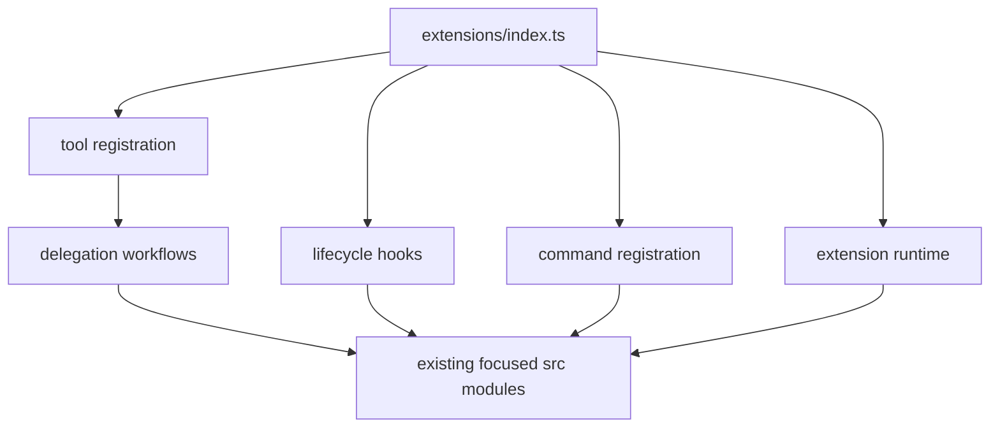

# `extensions/index.ts` refactoring specification

Status: draft for review  
Baseline: `main` at `85d9c90`  
Scope: structure and testability only; no intentional runtime behavior change

## 1. Purpose

Refactor the 1,021-line `extensions/index.ts` into cohesive, independently
testable modules while preserving the installed Pi extension's public surface,
safety properties, event ledger, result shapes and runtime behavior.

The refactoring is successful when `extensions/index.ts` becomes a small
composition root and the bounded delegation workflow can be tested by behavior
without reading TypeScript source text.

### Baseline precondition

The baseline must be green before Phase 0 begins. At the time this draft was
written, `npm run check` passes at `85d9c90`, but `npm test` does not:
`tests/extension-contract.test.mjs` line 1 contains literal `\n` sequences from
`ce9910d`, which comment out the `node:test` import and produce
`ReferenceError: test is not defined`. This pre-existing defect must be fixed
and the restored pass count recorded in a separate preparatory change. The
refactor must not absorb that repair invisibly into a large extraction commit.

## 2. Why this work is needed

The entrypoint currently owns six different responsibilities:

1. TypeBox schemas for Pi tool parameters;
2. persistent configuration access and environment precedence;
3. registration and implementation of two delegation tools;
4. the full bounded implementation/retry/verification state machine;
5. Pi lifecycle hooks for setup, context injection and result compaction;
6. eight interactive commands and their mutable session state.

The extracted `src/*.mjs` modules already isolate most low-level mechanisms,
but the decisions connecting them remain inside one closure. Consequently:

- the most important workflow is difficult to exercise without a real Pi host;
- `tests/extension-contract.test.mjs` still uses source-text assertions for
  several orchestration guarantees;
- changes to commands, lifecycle hooks or delegation share one large conflict
  surface;
- mutable process, session and repository state have no explicit owner;
- failure and return branches are repetitive and easy to make inconsistent.

This is a maintainability and verification refactor. It is not a redesign of
bounded delegation.

## 3. Goals

- Keep `extensions/index.ts` at or below 100 lines.
- Make the entrypoint responsible only for constructing runtime dependencies
  and registering tools, hooks and commands.
- Move candidate-only delegation and executing delegation into separate
  workflow modules.
- Give mutable runtime state and engine configuration explicit owners.
- Replace the critical source-regex tests with behavioral registration and
  workflow tests.
- Preserve all existing failure classifications, event names, tool results,
  usage accounting and safety gates.
- Make each extraction independently reviewable and releasable.

## 4. Non-goals

This refactor must not:

- add new tools, commands, candidate operations or specification versions;
- change the two-file delegation limit;
- change retry count, retry eligibility or RepairPacket contents;
- introduce a generic workflow framework, dependency-injection container or
  event bus;
- move from TypeBox or change the schemas visible to Pi;
- change model prompts, endpoint discovery or configuration precedence;
- add rollback after a completed candidate application;
- change .NET verification commands or TRX semantics;
- change training-data schemas or redaction policy;
- rename artifact paths under `.pi/offline-engine/`;
- update companion dependencies as part of the same change;
- claim semantic task completion from compiler/test success.

Any such change requires a separate specification and pull request.

## 5. Public compatibility contract

The following surface is frozen for this refactor.

### 5.1 Package entrypoint

- `package.json#pi.extensions` continues to load
  `./extensions/index.ts`.
- The file continues to default-export a function accepting Pi's
  `ExtensionAPI`.
- The supported baseline remains Pi `0.86.1` and Node.js `>=22.19.0`.

### 5.2 Tools

The extension continues to register exactly these owned tools:

- `delegate_implementation`;
- `execute_delegated_implementation`.

Their labels, descriptions, prompt snippets and prompt guidelines must remain
byte-for-byte equivalent. Parameter schemas must remain structurally
equivalent when normalized to JSON. Any deliberate wording or schema change
belongs in a separate change.

`ImplementationSpec v1` retains:

- `operation: "modify_symbol"`;
- one or two `scope.allowed_files` entries;
- explicit `allow_new_files`, `allow_dependencies` and
  `allow_public_api_change` booleans;
- at least one declared build or test verification target.

### 5.3 Commands

All command names and accepted modes remain unchanged:

| Command | Modes |
|---|---|
| `/offline-context` | `on`, `off`, `refresh`, `status` |
| `/offline-compact` | `on`, `off`, `status` |
| `/offline-doctor` | report only |
| `/offline-setup` | discovery, explicit endpoint/model, `reset` |
| `/offline-tools` | `minimal`, `restore`, `status` |
| `/offline-training` | `on`, `off`, `status`, `export` |
| `/offline-stats` | report only |
| `/offline-status` | report only |

Notification severity and meaningful message content are part of the
compatibility contract.

### 5.4 Pi lifecycle hooks

Registration and ordering semantics must be preserved for:

- `session_start`;
- `session_compact`;
- `session_tree`;
- `before_agent_start`;
- `context`;
- `tool_result`.

The two handlers currently registered for both `session_start` and
`before_agent_start` may be combined only if tests prove that observable order
and behavior are unchanged.

### 5.5 Event ledger

Existing event type names must not be renamed or silently dropped:

- `tiny_started`, `tiny_finished`, `tiny_failed`;
- `tiny_model_retry_scheduled`;
- `candidate_applied`;
- `verification_finished`, `delegated_verification_passed`;
- `repair_packet_created`;
- `delegated_implementation_escalated`;
- `delegated_implementation_runtime_failure`;
- `repo_capsule_injected`;
- `tool_result_compacted`;
- `training_capture_skipped_sensitive_path`;
- `training_capture_failed`.

Field names consumed by `src/stats.mjs` and training export are also frozen.
Before extraction, tests must capture representative complete event objects,
not only their `type` values.

## 6. Safety and behavioral invariants

The refactored implementation must preserve these invariants.

### Before mutation

1. `ImplementationSpec` is validated before endpoint work or filesystem writes.
2. Headless execution is rejected unless
   `PI_OFFLINE_ALLOW_HEADLESS_APPLY=1`.
3. Interactive execution asks for one confirmation naming the model, files and
   maximum attempts.
4. Verification infrastructure is preflighted before the first TinyCoder call.
5. Every attempt captures a fresh snapshot of all allowed files.
6. Candidate schema and scope are validated before a mutation queue is entered.
7. Candidate paths are resolved inside the workspace.

### During mutation and verification

1. All candidate target paths are protected by Pi file mutation queues.
2. The snapshot is rechecked immediately before applying the candidate.
3. Every candidate is saved before it is applied.
4. `replace_text` remains exact and requires one occurrence.
5. Verification uses only the checks declared in the spec and retains
   `--no-restore`.
6. Build failure prevents the test step.
7. A successful test process without positive TRX execution evidence fails
   verification.

### Retry semantics

1. Total TinyCoder calls never exceed `maxAttempts` (`1..3`).
2. Red verification creates the existing verification `RepairPacket`.
3. Invalid candidate or malformed TinyCoder output receives a bounded model
   output retry while attempts remain, including after an earlier candidate
   modified the workspace.
4. A model-output retry after red verification embeds the prior verification
   RepairPacket; compiler/test evidence must not be lost.
5. Transport, timeout, apply and verification-infrastructure failures are not
   retried as model-output failures.
6. Every attempt snapshots the current workspace, so post-mutation repair is
   validated against the current preimage.
7. Exhaustion returns control to the main model with cumulative changed files
   and accurate `workspace_modified` state.

### Completion and accounting

1. Successful mechanical verification returns
   `status: "verification_passed"` and `task_complete: false`.
2. Nested usage is accumulated across every TinyCoder attempt and returned to
   Pi in disjoint usage fields.
3. Training capture remains opt-in and best-effort; recorder failure cannot
   change the coding outcome.
4. Candidate-only delegation never writes repository source files.

## 7. Target module structure

The filenames below are normative. Small adjustments require justification in
the implementation PR, but responsibility boundaries must remain equivalent.

```text
extensions/
  index.ts                         # composition root only
  delegation-schema.ts             # TypeBox schemas exposed to Pi
  extension-runtime.ts             # runtime/config construction and state owner
  register-delegation-tools.ts     # Pi tool adapters and UI boundary
  register-lifecycle-hooks.ts      # Pi event subscriptions
  register-offline-commands.ts     # eight command adapters

src/
  delegation-candidate-workflow.mjs
  delegation-execution-workflow.mjs
  delegation-attempt.mjs
  delegation-results.mjs
  ...existing focused modules...

tests/
  extension-registration.test.mjs
  delegation-candidate-workflow.test.mjs
  delegation-execution-workflow.test.mjs
  delegation-attempt.test.mjs
  ...existing tests...
```

Do not create a directory hierarchy deeper than this during the first
refactor. The repository is still small enough that flat, clearly prefixed
modules are easier to navigate.

## 8. Responsibilities and dependencies

### `extensions/index.ts`

Allowed responsibilities:

1. create the runtime object;
2. apply the companion environment default;
3. call the three registration functions;
4. default-export the Pi extension factory.

It must not contain workflow branches, command parsing, filesystem operations
or result construction.

Expected shape:

```ts
export default function offlineEngine(pi: ExtensionAPI) {
  const runtime = createExtensionRuntime({ pi, env: process.env });
  registerDelegationTools(pi, runtime);
  registerLifecycleHooks(pi, runtime);
  registerOfflineCommands(pi, runtime);
}
```

The snippet communicates ownership; it is not mandatory implementation text.

### `extensions/delegation-schema.ts`

- Own TypeBox declarations only.
- Export `DelegationParametersSchema` and, where useful for tests,
  `ImplementationSpecSchema`.
- Contain no runtime configuration or Pi registrations.
- Keep runtime validation in `src/implementation-spec.mjs`; TypeBox remains the
  host-facing schema, not the safety authority.

### `extensions/extension-runtime.ts`

Own extension-lifetime mutable state:

```ts
interface ExtensionRuntimeState {
  savedActiveTools: string[] | null;
  compactToolResults: boolean;
  repoCapsuleEnabled: boolean;
  lastRepoCapsuleFingerprint: string | null;
  trainingCaptureEnabled: boolean;
  autoSetupAttempted: boolean;
}
```

Own a small configuration facade with:

- `file`;
- `reload()`;
- `save(patch)`;
- `settings()`.

Configuration must be created inside the extension factory, not as mutable
module-global state. This prevents test instances and multiple Pi extension
instances from sharing cached configuration accidentally.

The current scalar state semantics are preserved. In particular, this refactor
must not silently turn capsule fingerprints or command toggles into per-working-
directory state; that would be a separate behavior change.

The runtime may expose `exec` and a `withMutationQueues` adapter because those
are Pi capabilities. It must not grow into a service locator containing every
function in `src`.

### `extensions/register-delegation-tools.ts`

- Define Pi metadata for the two tools.
- Translate Pi execution arguments into workflow input.
- Own the interactive confirmation and `onUpdate` presentation boundary.
- Own the no-UI refusal and `PI_OFFLINE_ALLOW_HEADLESS_APPLY` override.
- Provide Pi `exec` and mutation-queue capabilities to workflows.
- Translate workflow results into Pi tool return objects only when the workflow
  cannot directly return the stable tool result shape.

It must not contain the retry loop or verification state machine.

### `src/delegation-candidate-workflow.mjs`

Own candidate-only behavior:

- validate spec;
- snapshot allowed files;
- emit TinyCoder lifecycle events;
- call TinyCoder;
- validate and optionally persist the candidate;
- produce the existing accepted/rejected outcome and usage.

All I/O capabilities must be passed explicitly in one options object so tests
can use in-memory fakes. Do not mock Node module imports globally.

The workflow should return the current Pi-visible `content`, `details` and
`usage` shape. Keeping result construction near the behavior reduces adapter
translation and compatibility drift; the registration layer adds only Pi UI
and host concerns.

### `src/delegation-execution-workflow.mjs`

Own the top-level bounded execution state:

- preflight;
- attempt loop;
- cumulative usage and changed-file tracking;
- terminal success, exhaustion and failure classification;
- training run lifecycle.

It delegates one iteration to `delegation-attempt.mjs`. The workflow must make
the state transitions visible in ordinary data rather than relying on closure
side effects.

Suggested internal state:

```js
{
  attempt,
  stage,
  repairPacket,
  lastVerification,
  workspaceModified,
  cumulativeChangedFiles,
  attempts,
  nestedUsage
}
```

This object is internal and is not a new public persistence format.

### `src/delegation-attempt.mjs`

Own exactly one TinyCoder attempt:

- snapshot current allowed files;
- call and validate TinyCoder output;
- classify terminal/invalid/candidate output;
- save and apply a valid candidate;
- run verification;
- return a discriminated outcome to the outer workflow.

Recommended outcome kinds:

```text
invalid_model_output
terminal_model_status
verification_passed
verification_failed
runtime_failure
```

These are internal control-flow labels. They must not replace public status,
reason or event strings.

### `src/delegation-results.mjs`

Own repeated construction of Pi-visible execution result bodies and details:

- verification success;
- TinyCoder terminal status;
- model-output escalation;
- runtime failure;
- attempts exhausted.

Factories must accept already-classified data and must not perform I/O. This
module exists to prevent content JSON and `details` from drifting apart.

### `extensions/register-lifecycle-hooks.ts`

Own auto-setup, repository capsule lifecycle, context de-duplication, code-tool
policy and tool-result compaction. State is read or changed only through the
runtime object.

### `extensions/register-offline-commands.ts`

Own the eight commands and the shared doctor-report helper. Commands may call
existing focused `src` functions but must not reach into another registration
module's private state.

## 9. Dependency direction



Rules:

- `src/*.mjs` must not import from `extensions/`.
- Workflow modules must not import Pi types or call `ctx.ui`.
- Registration modules may import workflows and Pi APIs.
- Registration modules must not import each other.
- Shared state flows through `ExtensionRuntime`, never through new mutable
  module globals.
- No circular imports are permitted.

## 10. Testing strategy

### 10.1 Characterization before extraction

Before moving production code, add a fake Pi host that records:

- registered tool metadata and execute functions;
- registered commands and handlers;
- lifecycle event names and handlers;
- active-tool reads/writes;
- `exec` calls;
- UI notifications, confirmations and selections.

Characterization tests must assert the current registration surface and the
observable results of representative handlers. They become the guardrail for
the subsequent moves.

### 10.2 Workflow behavior tests

Candidate workflow cases:

- rejected spec performs no snapshot or TinyCoder call;
- valid non-candidate terminal response is returned unchanged;
- invalid candidate returns current error/details/usage shape;
- valid candidate is persisted but never applied;
- TinyCoder transport failure emits `tiny_failed` and preserves the current
  thrown error contract.

Execution workflow cases:

- preflight failure is classified as infrastructure with attempt `0`;
- invalid candidate retries up to the bounded maximum;
- malformed repair output after a red verification retains the prior
  verification RepairPacket;
- terminal TinyCoder status before and after mutation reports the correct
  escalation and workspace state;
- successful verification reports `task_complete: false`;
- exhausted red verifications retain the final verification and cumulative
  changed files;
- transport/apply/verification infrastructure failures do not enter the cheap
  model-output retry path;
- usage is summed across all attempts;
- training recorder failure never changes the workflow result.

### 10.3 Registration tests

Replace critical source-regex assertions with tests against the fake host:

- exact owned tool and command names;
- schema has the current strict structure;
- expected lifecycle handlers are registered;
- prompt guidelines include semantic-completion and sibling-mutation guards;
- headless denial and user cancellation perform no preflight or model call;
- session compaction/tree navigation invalidates the capsule fingerprint;
- command modes update only their owned runtime state.

Small static smoke checks may remain for entrypoint wiring, but they must not be
the only evidence for runtime semantics.

### 10.4 Existing gates

Every extraction commit must pass:

```bash
npm run check
npm test
npm run gate:local
npm run gate:pi
```

Before merge, also run:

```bash
npm audit --omit=dev --audit-level=high
npm run gate:install -- --package-dir .
```

The final refactor must also complete the manual fixture procedure and satisfy
the acceptance decision in `docs/ACCEPTANCE_V0.md`. A bounded escalation is a
valid runtime outcome but does not count as a successful acceptance run.

## 11. Implementation sequence

Each phase should be one reviewable commit or a small PR with green gates.

### Phase 0 — characterization harness

1. Confirm the preparatory baseline repair is merged and `npm test` is green.
2. Add the fake Pi host.
3. Capture the registration surface and important UI behavior.
4. Add missing end-to-end workflow branch tests around the current code where
   feasible.

No production move occurs in this phase.

### Phase 1 — schema and runtime ownership

1. Extract TypeBox schemas to `extensions/delegation-schema.ts`.
2. Move config caching and mutable flags into `extension-runtime.ts`.
3. Move `uniqueAbsolutePaths`, mutation queue composition and best-effort
   training capture behind narrowly named runtime/workflow helpers.
4. Confirm multiple runtime instances do not share mutable state.

### Phase 2 — candidate-only workflow

1. Extract candidate-only behavior.
2. Preserve tool metadata in the registration adapter.
3. Add behavioral tests for all candidate-only outcomes.

### Phase 3 — executing workflow

1. Extract result factories first.
2. Extract one-attempt execution.
3. Extract the outer retry/preflight state machine.
4. Add branch-complete tests before deleting the old inline code.

This is the highest-risk phase and must not be combined with command or hook
extraction.

### Phase 4 — lifecycle hooks

Extract hooks without changing their registration order. Test capsule refresh,
context de-duplication, automatic endpoint setup and compaction.

### Phase 5 — commands

Extract all commands together because they share runtime/config access and the
doctor helper. Preserve messages and severity.

### Phase 6 — composition cleanup

1. Reduce `index.ts` to the composition root.
2. Remove superseded source-regex tests.
3. Update documentation references.
4. Run all release and machine-level gates.

## 12. Review and size constraints

- `extensions/index.ts`: at most 100 physical lines.
- New registration modules: target at most 250 lines each.
- New workflow modules: target at most 300 lines each.
- A file exceeding its target requires a written justification in the PR.
- Do not reformat unrelated existing modules.
- Do not rename existing `src` modules merely for directory aesthetics.
- Preserve git history through extraction-first commits; avoid a single
  delete-and-recreate change for the entrypoint.

Line count is a diagnostic, not the design goal. Cohesion, explicit state and
behavioral testability take precedence over meeting a number by introducing
thin forwarding files.

## 13. Acceptance criteria

The refactor is complete only when all statements below are true:

- [ ] `extensions/index.ts` is a composition root of at most 100 lines.
- [ ] No mutable configuration or session state remains at module scope.
- [ ] Candidate-only and executing workflows are separately testable without
      starting Pi.
- [ ] The execution retry loop is absent from Pi registration modules.
- [ ] Critical guarantees formerly checked only by source regex have behavioral
      tests.
- [ ] Tool metadata, schemas, commands and lifecycle hooks are compatible with
      the baseline.
- [ ] All public result, details, event and artifact shapes are preserved.
- [ ] Retry after red verification preserves prior diagnostics across malformed
      or invalid model output.
- [ ] Safety invariants in section 6 have explicit test coverage.
- [ ] `npm run check`, `npm test`, `gate:local`, `gate:pi`, audit and
      `gate:install` pass on the supported Node/Pi baseline.
- [ ] The manual acceptance fixture shows no scope escape, hidden restore or
      incoherent workspace state.
- [ ] Documentation reflects the new file locations without claiming new
      product capability.

## 14. Risks and controls

| Risk | Control |
|---|---|
| Event or result shape drifts during extraction | Golden/structural assertions over returned data and event rows |
| Retry behavior changes subtly | Table-driven workflow tests covering state before and after mutation |
| State becomes shared across sessions/tests | Runtime constructed per extension instance; multi-instance test |
| Registration order changes | Fake-host registration trace assertion |
| Excessive dependency injection obscures code | One explicit options object per workflow; no container or generic tokens |
| Large move hides semantic edits | Extraction-only commits followed by separate cleanup commits |
| Tests pass while real Pi loading breaks | `gate:pi` on every phase and `gate:install` before merge |
| Refactor expands into feature work | Enforce non-goals and split behavior changes into later PRs |

## 15. Deferred follow-up opportunities

The following may be considered only after this refactor is merged and proven:

- a formal transition table or reducer for the execution state machine;
- stable schema versioning for event and training ledgers;
- a true held-out split for generated training/evaluation data;
- provider-independent verification adapters beyond .NET;
- persistence of user command toggles between Pi processes;
- metrics for delegation eligibility and semantic acceptance.

They are intentionally excluded from the current implementation scope.
